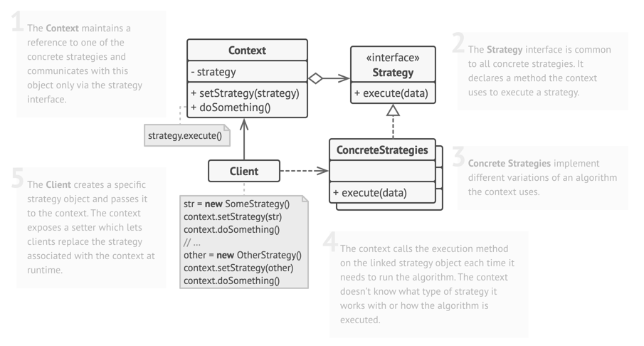
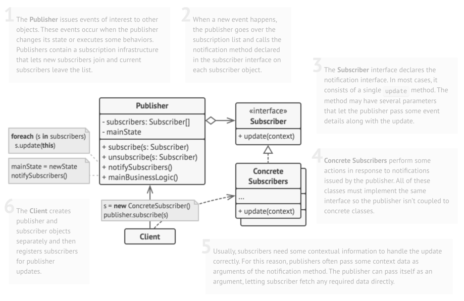
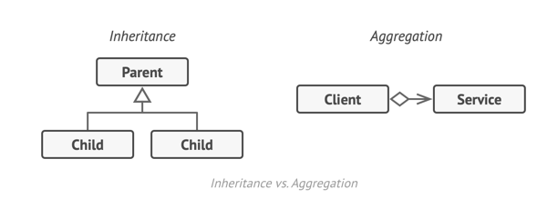
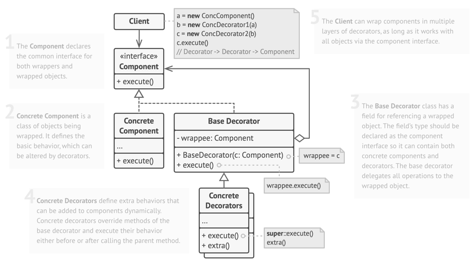
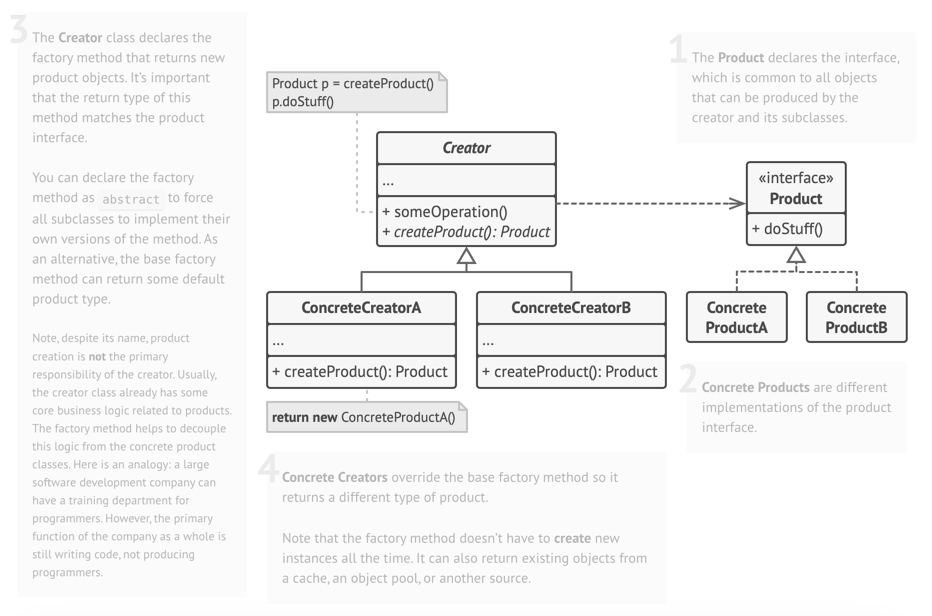
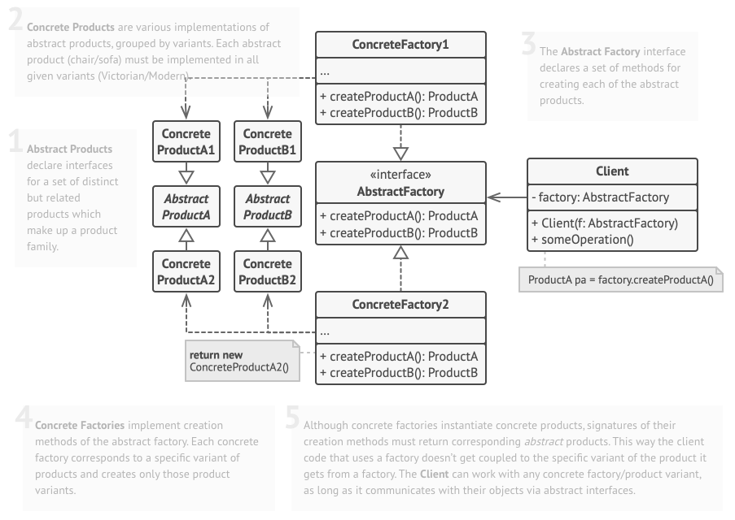

# Design Pattern

## Strategy Pattern
*The Strategy Pattern defines a family of algorithms,
encapsulates each one, and makes them interchangeable.
Strategy lets the algorithm vary independently from
clients that use it.*

### Intent
- Attach additional responsibilities to an object dynamically. Decorators provide a flexible alternative to subclassing for extending functionality.
- Client-specified embellishment of a core object by recursively wrapping it.

    NOTE: 
        
    - Context can be either a CONCRETE class or ABSTRACT class.
    
    - Client can either be a new Class or instance of Context

## Observer Pattern
*The Observer Pattern defines a one-to-many
dependency between objects so that when one
object changes state, all of its dependents are
notified and updated automatically.*

## Intent
- Define a one-to-many dependency between objects so that when one object changes state, all its dependents are notified and updated automatically.
- Encapsulate the core (or common or engine) components in a Subject abstraction, and the variable (or optional or user interface) components in an Observer hierarchy.
- The "View" part of Model-View-Controller.

    Design Principle:

    - Identify the aspects of your application that vary and separate them from what stays the same.
    - Program to an interface, not an implementation.
    - Favor composition over inheritance.

    NOTE:
    
    - Strive for loosely coupled designs between objects that interact.

## Decorator Pattern

*The Decorator Pattern attaches additional
responsibilities to an object dynamically.
Decorators provide a flexible alternative to
subclassing for extending functionality.*

## Intent
- Attach additional responsibilities to an object dynamically. Decorators provide a flexible alternative to subclassing for extending functionality.
- Client-specified embellishment of a core object by recursively wrapping it.

    Design Principle:
    - Classes should be open for extension, but closed for modification.

    NOTE:

    - Be careful when choosing the areas of code that need to be extended; applying the Open-Closed Principle EVERYWHERE is 
    wasteful and unnecessary, and can lead to complex, hard-to-understand code.

## Factory Method Pattern
*The Factory Method Pattern defines an interface
for creating an object, but lets subclasses decide which
class to instantiate. Factory Method lets a class defer
instantiation to subclasses.*

### Intent
- Define an interface for creating an object, but let subclasses decide which class to instantiate. Factory Method lets a class defer instantiation to subclasses.
- Defining a "virtual" constructor.
- The new operator considered harmful.

    Design Principle:

    - Depend upon abstractions. Do not depend upon concrete classes.

    NOTE:

    - instantiation is an activity that shouldn’t always be done in public and can often lead to coupling problems
    - This pattern is super handy when the exact type of object isn’t known until runtime, or when you want to keep your code flexible and easy to extend.

## Abstract Factory Pattern
*The Abstract Factory Pattern provides an interface
for creating families of related or dependent objects
without specifying their concrete classes.*

### Intent
- Provide an interface for creating families of related or dependent objects without specifying their concrete classes.
- A hierarchy that encapsulates: many possible "platforms", and the construction of a suite of "products".
- The new operator considered harmful.

    NOTE:

    -  In an Abstract Factory pattern, the methods that create products are often implemented as factory methods. This 
    approach aligns with the Abstract Factory's purpose, which is to define an interface for creating families of related
    products. Each method in the Abstract Factory is responsible for creating a specific product, and subclasses of the 
    Abstract Factory use factory methods to provide the concrete implementations of these products. This combination allows
    for flexible and scalable creation of related objects without specifying their concrete classes.

