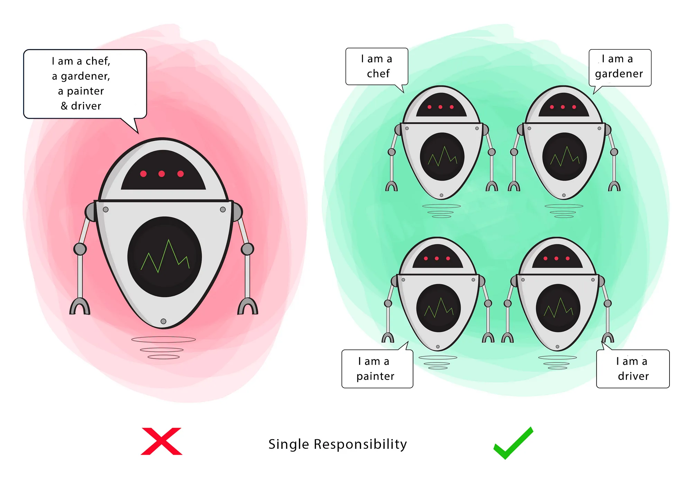
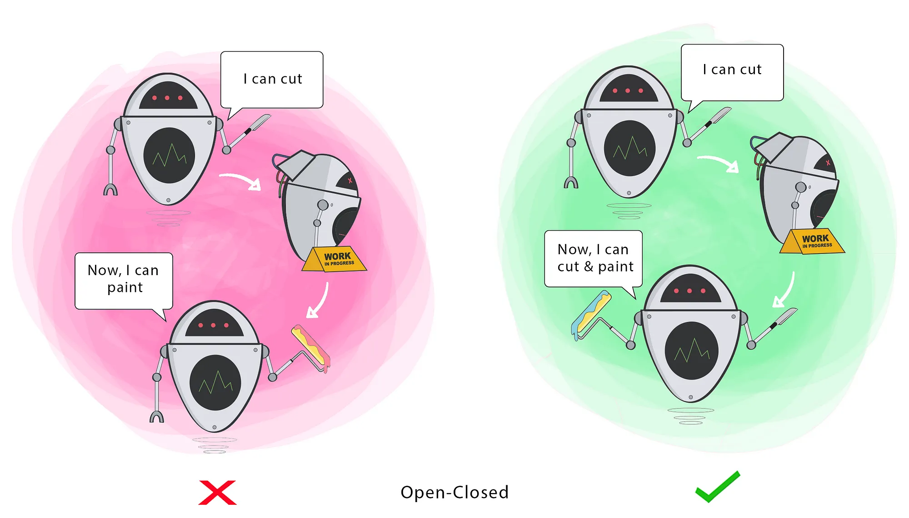
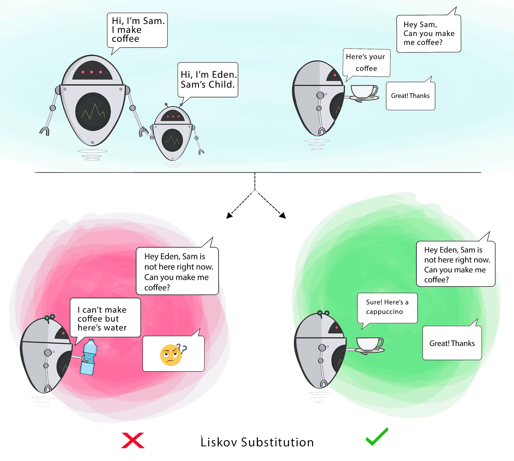
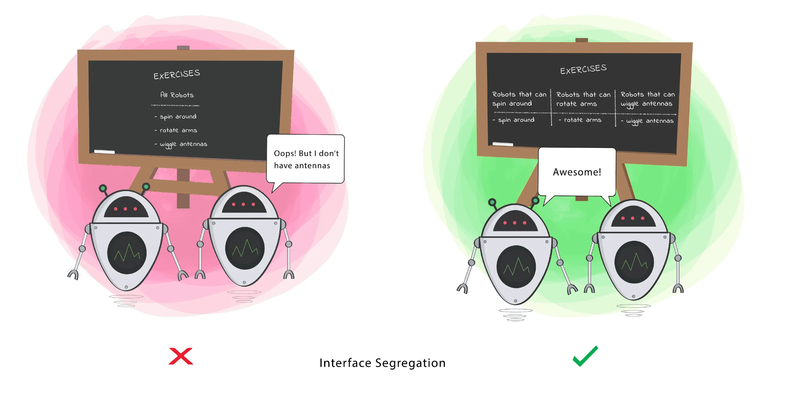
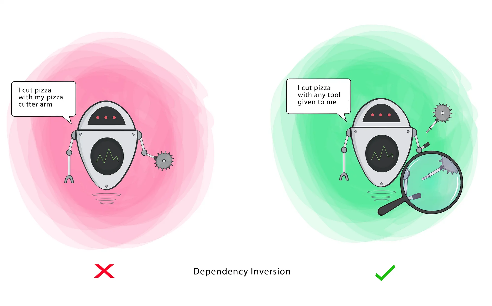

# LOW-LEVEL-DESIGN

## SOLID Principles
SOLID is a mnemonic acronym for five design principles intended to make object-oriented designs more understandable, 
flexible, and maintainable.

1. **Single Responsibility Principle** tells that every class 
    - should have only one *reason* to change.
    - should have only one *responsibility*.
    
   

2. **Open / Closed Principle** tells that a class should be *open for extension* but *closed for modification*.
   - Changing the current behaviour of a Class will affect all the systems using that Class. 
   - If you want the Class to perform more functions, the ideal approach is to add to the functions 
   that already exist NOT change them.
   - A class which is in production should not be modified, so then how to modify this class?
   - So we can think like giving the features/responsibility to some interface, and now we can create concrete classes
   each of which can have its own feature implementation. This is also known as `Coding to an Interface`.
   - Now to modify the class behaviour we can inject the concrete class, as per our requirement.

   **Why do we need interface/abstract class here?**
   - To define a contract (in this case the feature)

   **Do we really need interface/abstract class?**
   - We can achieve Open/Closed Principle using inheritance where the child classes can modify/override the feature.
   - But, we should rely on composition over inheritance since this can make the code losely coupled, think why and how?
   - Moreover if we dont use interface/abstract class it can affect scalability as we increase stratergies.

   

      NOTE: Understanding the Shift from SRP to OCP
      
      When we apply the Open/Closed Principle (OCP) after adhering to the Single Responsibility Principle (SRP), it can
      sometimes feel like you're adding more responsibilities to a class, but you're actually enhancing the flexibility 
      of your design by delegating these responsibilities to other classes or interfaces.

3. **Liskov Substitution Principle**
   
   If class B is a subtype of class A, we should be able to replace A with B without disrupting the behavior of our program.

   
      
         NOTE: After we apply Open / Closed Princple, we end up with using inheritance, or composition through delegation.
         This made the sub-class vulnerable.

   **How OCP Can Lead to LSP Violations**

   1. **Inheritance as a Common OCP Strategy:**

   - To adhere to the OCP, developers often use inheritance to extend the behavior of a base class without modifying its code. 
   For example, you might create a base class Car and then create subclasses like MotorCar and ElectricCar to extend the functionality.
   - While this approach satisfies the OCP by allowing new types of cars to be added without altering the existing Car 
   class, it can inadvertently lead to LSP violations.
   
   2. **Subclasses Not Perfectly Substitutable:**

   - LSP requires that any subclass should be usable in place of its superclass without altering the expected behavior.
   However, when extending a class to satisfy OCP, the subclass may introduce new behavior that breaks this substitutability.
   
   - For example, if ElectricCar inherits from Car, but ElectricCar doesn't have an engine, overriding a method like 
   turnOnEngine (which might throw an exception) can violate LSP because the subclass cannot fulfill the contract established by the superclass.

   3. **Behavioral Contracts and Unintended Consequences:**

   - The base class might have certain assumptions or guarantees (behavioral contracts) about its methods that the subclass
   unintentionally violates. This happens often when extending a class by adding or modifying methods to fit new requirements 
   while maintaining adherence to OCP.

   - When subclasses diverge in behavior from what is expected by the superclass, they can break the system when used 
   polymorphically, leading to bugs and unexpected behavior. This is a direct conflict with LSP, which assumes that such 
   substitutions should work seamlessly.

   **The Core Issue**

   - The core issue arises when the extension required by OCP causes the subclass to deviate from the expected behavior 
   of the superclass, leading to LSP violations. This is particularly problematic when the subclass cannot naturally 
   fulfill the superclass's contract or when the extension introduces side effects that break the expected polymorphic behavior.

   **Mitigating the Conflict**

   - **Prefer Composition over Inheritance:** Instead of relying solely on inheritance to extend functionality, use composition. This can allow you to adhere to OCP while reducing the risk of LSP violations.
   - **Use More Specific Abstractions:** When defining your base class or interface, be as specific as possible about the behavior. For example, instead of having a general Bird class, you could have a FlyingBird and a NonFlyingBird class to avoid issues where not all birds can fly.
   - **Be Mindful of Behavioral Contracts:** Ensure that any subclass truly adheres to the expected behavior of the superclass, maintaining substitutability and avoiding unexpected side effects.

   **Code Explanation:**

   In the original code, the ElectricMotorBike class violated the Liskov Substitution Principle (LSP) because it inherited methods from the Bike interface that didn't apply to it, specifically the turnOnEngine() method. This led to runtime errors when ElectricMotorBike objects were used in place of MotorBike.

   To solve this, I refactored the design by:

   **Creating Separate Interfaces:**
   - The Bike interface now only includes the accelerate() method, which applies to all types of bikes.
   - The EngineBike interface extends Bike and adds the turnOnEngine() method, specifically for bikes with engines.

   **Implementing the Interfaces:**
   - MotorBike implements the EngineBike interface, which includes both accelerate() and turnOnEngine().
   - ElectricBike implements the Bike interface, focusing solely on accelerate().

   **Replacing References:**
   - The Main class uses a Bike reference that can be replaced by different implementations (MotorBike and ElectricBike).
   - This demonstrates how the program continues to function correctly when the Bike reference is reassigned, showcasing
     compliance with LSP.

   This solution ensures that the ElectricBike class can be substituted for MotorBike without violating LSP, while
   maintaining the integrity of the program and avoiding runtime errors.

4. **Interface Segregation Principle**:

   Clients should not be forced to depend on methods that they do not use.

   

   **Code Explanation**

   **Forced Implementation:** In the ISP.WITHOUT package, ReportGenerator has both PDFReportGenerator() and ExcelReportGenerator() methods.
   ExcelFileGenerator and PDFFileGenerator are forced to implement both methods, even though they only support one type of
   report. This results in UnsupportedOperationException for unsupported methods.

   **Create Specific Interfaces:** In the ISP.WITH package, create separate interfaces like ExcelReportGenerator and 
   PDFReportGenerator. Each class implements only the interface relevant to its functionality.

5. **Dependency Inversion Principle:**

   High-level modules should not depend on low-level modules. Both should depend on the abstraction.

   Abstractions should not depend on details. Details should depend on abstractions.

   **Code Explanation**

   
   
## References / Links

   - **Java OOPs**
     - https://www.youtube.com/playlist?list=PL9gnSGHSqcno1G3XjUbwzXHL8_EttOuKk
   - **SOLID Principles**
     - https://www.youtube.com/watch?v=XI7zep97c-Y&t=457s
     - https://medium.com/backticks-tildes/the-s-o-l-i-d-principles-in-pictures-b34ce2f1e898
   - **Design Patterns**
     - https://refactoring.guru/design-patterns
     - https://www.youtube.com/playlist?list=PLrhzvIcii6GNjpARdnO4ueTUAVR9eMBpc